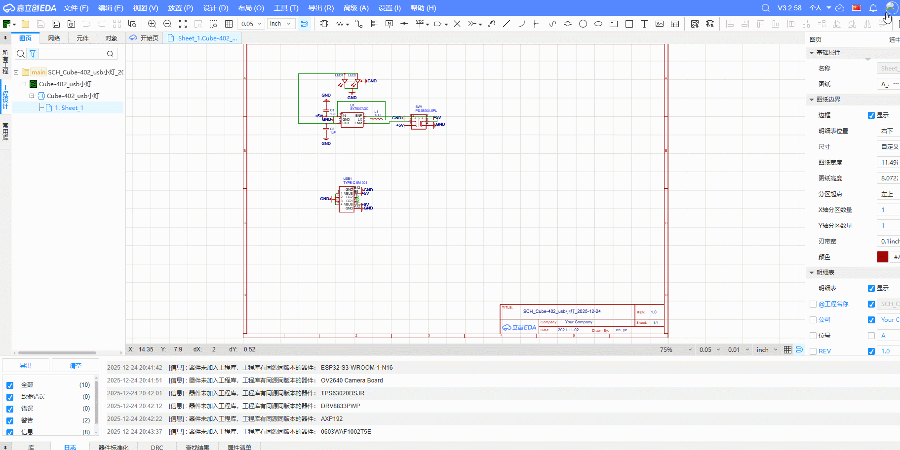
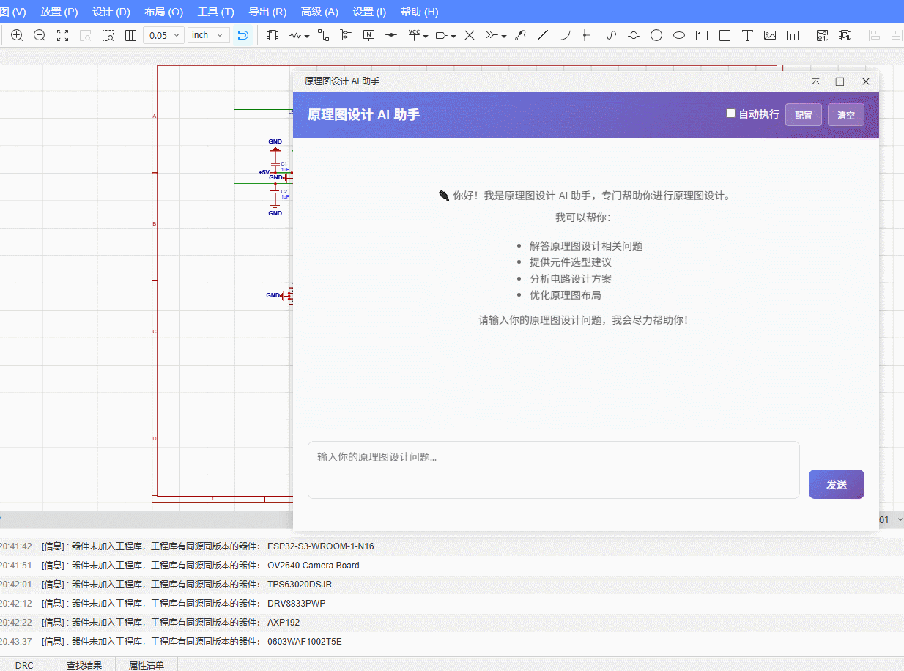
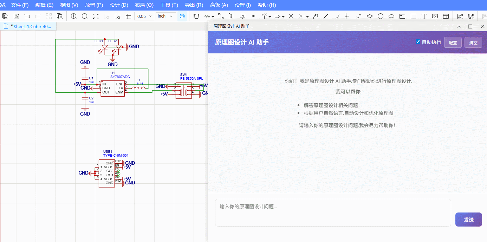
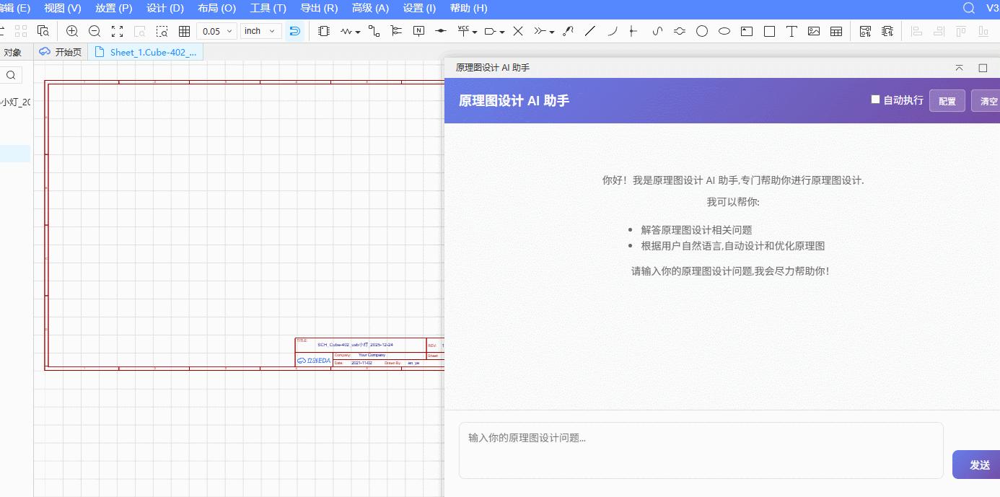
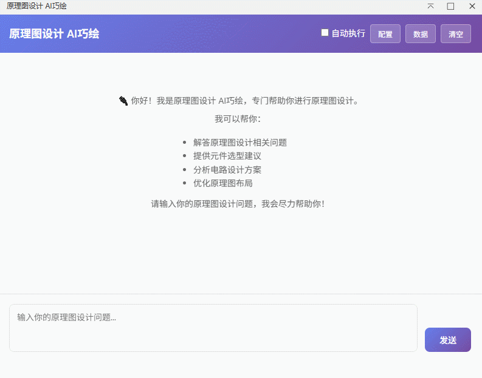
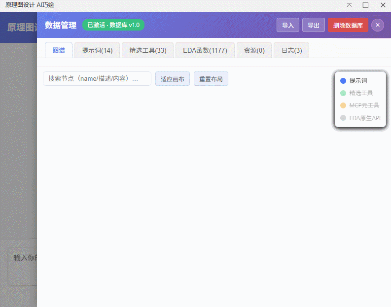
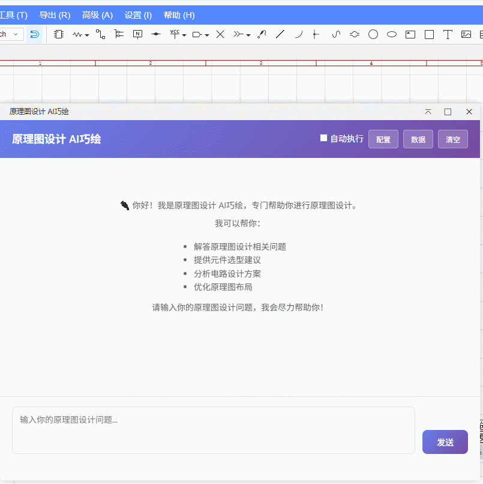

[简体中文](./README.md) | [English](./README.en.md)

# AI巧绘 — Schematic Design Assistant

> For detailed developer documentation, visit: [https://prodocs.lceda.cn/cn/api/guide/](https://prodocs.lceda.cn/cn/api/guide/)


## What's New in v1.0.7

This release focuses on making the AI's instruction framework more focused, capability retrieval more precise, and the underlying structure cleaner. Highlights:

- **🧭 Progressive Prompt Refactoring**: The original 13 prompts were reorganized into an on-demand drill-down structure of "minimal index `prompt_index` + 5 domain packages `domain_*` + 5 knowledge leaves `knowledge_*` + 3 execution leaves `execution_*`". Only the index is injected on first load, with per-scenario subsets fetched on demand, easing focus dilution from long enumerations.
- **🧩 Curated Tool Aggregation**: Each tool's implementation and its `*_SCHEMA` metadata (description / parameters / semantic tags / source / domain) are now co-located; new `semantic_tags`/`source`/`domain` fields mean adding or removing a tool touches only one place.
- **🔀 Unified Tool Entry**: `callTool` acts as a protocol shell dispatching all curated tools and native EDA functions; `listTools({scenario})`/`listPrompts({domain})` cut injected tool count down to ~8–12; `searchTools` is enhanced with entry self-described `semantic_tags` inverted-index retrieval, replacing the central registry.
- **📁 MCP Module Relocation**: The former top-level `eda-api.js`, `mcp-eda.js`, `mcp-prompt.js` and `vendor/*.min.js` were consolidated into the `iframe/mcp/` directory, cleanly separating the protocol shell from curated tools / prompts / resources.

> For full history, see the "Changelog" section below and `CHANGELOG.md`.


## Feature Overview

AI巧绘 is an intelligent tool designed specifically for schematic designers, featuring the following core capabilities:

1. **AI Chat**: Supports natural language Q&A with context management for quick answers to schematic design questions
2. **Tool Calling**: AI can invoke EDA APIs to read schematic information, such as querying selected components and reading schematic structures
3. **Code Execution**: Integrated with Volcano Engine ARK to generate code blocks for design scenarios; AI-generated code blocks support inline editing and run only after user confirmation (or with auto-execute enabled)
4. **Knowledge Graph**: D3 force-directed graph visualizing tool call chains and component relationships, with search-to-center and node highlighting
5. **Drawer Panel**: Six-tab drawer on the right (Graph / Prompts / Tools / EDA Functions / Resources / Logs) for one-click browsing
6. **Safety Confirmation**: Code execution requires user confirmation before running; an auto-execute toggle is available for streamlined workflows

### Private Server Mode

This extension can connect to an **external private server backend** for conversations (the backend forwards requests to ARK). Clarification:

- This extension only provides a "Private Server Login" jump entry. After logging in on the server page, the user obtains a Token to use in configuration.

---

## Core Modules & Collaboration

AI巧绘 is not a single chat box; it is a set of interfaces and an underlying data layer that each play a distinct role. Understanding how they divide the work helps you use it more efficiently.

| Module | What it is | What it does for you |
| --- | --- | --- |
| **Chat Interface** | The daily Q&A and operation entry | Describe needs in natural language; AI returns code blocks that can be executed on the canvas, editable before confirmation |
| **Data Drawer** (right-side six tabs) | Stores the "fuel" that drives the AI: prompts and tools | View / edit prompts (the AI's instruction framework) and tools (what the AI can call), so the AI fits your design habits |
| **Relation Graph** | Draws the drawer's data as a reference network | Before making changes, see clearly "which prompts a tool affects" to avoid breaking the AI by accidental deletion |

**How they work together (one-line summary)**:

> You describe needs in the **Chat Interface** → the AI relies on **prompts and tools in the Data Drawer** to understand and act → the **Relation Graph** helps you trace reference relationships among them.

Typical workflow:

1. First use: just chat; the AI works on built-in default prompts and tools.
2. Want team-specific conventions: open the "Data" drawer, first "Import → Import from Source" to activate the database, then edit prompts or add/remove tools.
3. Unsure before editing: switch to the "Graph" tab to see the references of the item, then decide whether to edit or delete.

## Quick Start

Get started in three steps:

1. **Install the extension**: Search "AI巧绘" in the EasyEDA Pro Extension Manager, or import the build output locally.
   
2. **Configure the AI channel**: Open the chat interface → click **Settings** in the top-right → fill in the Volcano Engine ARK API Key (or check "Use Private Server" and log in on the server page first to claim a Token).
   
3. **Start chatting**: Describe your need in the input box (e.g., "query detailed info of the selected component"), then click **Confirm Execution** on the AI's code block to apply it on the canvas.

> Advanced usage (editing prompts / tools, viewing the reference graph) is covered in the "Data Drawer" and "Relation Graph" sections below, which require activating the local database via "Import → Import from Source" first.

## Getting Started

### 1. Install the Extension

#### Install from Extension Marketplace
1. Open EasyEDA Pro
2. Navigate to **Advanced → Extension Manager**
3. Search for "AI巧绘" and install

#### Install from Local File
1. Download the build output (extension package under `./build/dist/`)
2. Go to **Advanced → Extension Manager → Import**
3. Select the extension package file to complete installation


### 2. Configure API Key

1. Enable the extension in Extension Manager, and make sure **External Interaction** is turned on
2. Open the AI巧绘 chat interface (via menu `AI巧绘` → `原理图设计助手`)
3. Click the **Settings** button in the top-right corner of the chat interface
4. Fill in the following information in the settings dialog:
   - **API Key**: Volcano Engine ARK API Key
   - **API Model**: API Model (not required when using private server mode)
   - **Use Private Server**: Optionally switch to private server mode, which only requires the API Key

> Note: You need to configure your own AI Key. To obtain ARK API credentials, visit the [Volcano Engine official website](https://www.volcengine.com/) to register and get your API Key and Model information. Alternatively, click the "私服登录" link in the settings dialog to claim a token.


### 3. Access Points

- Home / Sch / PCB Menu: `AI巧绘` → `原理图设计助手` to open the chat
- About: `AI巧绘` → `About...`

## Features

### AI Chat

Enter schematic design related questions in the input box, and AI will provide professional answers. Supports natural language Q&A with context management, understanding design intent and offering targeted suggestions.

AI can invoke EDA API tools to read schematic information, for example:
- Query detailed information of selected components (parameters, packages, etc.)
- Read the list of all components in the schematic
- Retrieve component pin information
- Analyze schematic structure and connection relationships

### Component Information Query

After selecting a component in the schematic, enter related questions in the chat interface (e.g., "query detailed information of this component"), and AI will call the EDA API to read the selected component's information and return detailed results.



### Multi-step Task Processing

AI巧绘 supports handling complex multi-step tasks, completing multiple operations at once. For example:
- Query multiple component information and perform analysis
- Batch read schematic data and process it
- Execute multiple tool calls to complete complex design tasks

Describe the task requirements in natural language, and AI will understand the task intent, automatically invoking multiple EDA API tools to complete multi-step tasks step by step.



### Auto Code Execution

AI can generate and execute code based on the conversation content for reading or modifying schematics. Code execution mechanism:

- **Confirm Execution**: By default, AI-generated code blocks are displayed in the chat interface and require clicking the "Confirm Execution" button to run, preventing accidental edits to your design
- **Auto Execution**: After enabling the "Auto Execute" toggle in the top-right corner, code blocks run automatically after a short delay, suitable for repeated batch operations
- **Editable**: You can modify parameters or logic in the code block before execution, and it runs with your adjusted content

Supported operations include:
- Batch modify component parameters
- Place components on the schematic
- Create wire connections
- Query and analyze schematic structure

### Data Drawer (Right-Side Six Tabs)

Click the **Data** button in the top-right of the chat interface to open the right-side drawer. It shows built-in data in **read-only preview** by default; after clicking "Import → Import from Source" to activate the local database, editing becomes available. The six tabs each address one concern:

- **Graph**: A reference-network diagram of prompts and tools. *When to use*: before editing or deleting an item, check here to see "which items it affects", avoiding accidental deletion that breaks the AI.
- **Prompts**: The AI's instruction framework (system prompts, role-based framework prompts, etc.). *When to use*: when you want to adjust the AI's tone, expertise, or constraints (e.g., component-selection rules), view or edit here.
- **Tools**: Custom tools and wrapped capabilities the AI can call directly. *When to use*: when you want to extend what the AI can do (e.g., a new batch operation), view or add here.
- **EDA Functions**: The complete list of EasyEDA native APIs. *When to use*: look up a native interface's capability and parameters as a reference for writing tools.
- **Resources**: Resource entries maintained by imported data files. *When to use*: view imported assets (view-only).
- **Logs**: Complete request/response records of each conversation. *When to use*: when reviewing what the AI actually called or why it failed, trace by session here.



### Relation Graph

The graph panel presents the reference relationships among prompts and tools as a force-directed graph:

- A larger node means it is referenced more often; a thicker edge means a stronger call relationship (weak references are shown as dashed lines)
- Click a node to highlight its associated chain; double-click a node to jump to its editing panel
- Search auto-centers on the unique matching node
- Hover over nodes to view detailed information



### Editable Code Blocks

AI-generated code blocks support inline editing while remaining executable:

- Click a code block to enter edit mode and modify parameters or logic
- Click execute after editing to run with the modified code
- Edit and read-only modes are mutually exclusive to prevent accidental changes

### Data Import & Export

The data panel provides local data management:

- **Import Data**: A prompt lets you choose "Import from Source" (load built-in tools and prompts; also the entry point to activate the database for the first time) or "Import from Local File" (import custom tools or prompts from an external JSON file)
- **Reset to Factory Default**: A separate entry that restores the database to the built-in default data (not part of the import flow above)
- **Export**: Export current data as a single JSON backup file to share with others
- **Storage**: All data is stored in the browser's local IndexedDB database (backed by AlaSQL for SQL capabilities), persisting after the extension is closed, with no network required



## Compatibility

- Requires EasyEDA Pro `>= 2.3.0` (consistent with extension.json `engines.eda`)

## Development & Build

1. Clone the repository

    ```shell
    git clone --depth=1 https://github.com/np1139059565/pro-schematic-ai-drafty.git
    ```

2. Install dependencies

    ```shell
    npm install
    ```

3. Build the extension package

    ```shell
    npm run build
    ```

4. Import the extension package from `./build/dist/` into EasyEDA for debugging

## Changelog

- See `CHANGELOG.md` for details

## Feedback & Support

- Issues: https://github.com/np1139059565/pro-schematic-ai-drafty/issues
- Please back up your design files before use; it is recommended to verify in a test project first

## Contributing

We welcome all forms of contributions! Whether reporting issues, suggesting features, or submitting code improvements, all are valuable support for the project.

### How to Contribute

1. **Fork this Repository**: Click the Fork button on the GitHub page to copy the repository to your account
2. **Create a Branch**: Create a new feature branch from `main`
   ```shell
   git checkout -b feature/your-feature-name
   ```
3. **Develop**: Make code modifications and test locally
4. **Commit Changes**: Commit your changes and push to your fork
   ```shell
   git commit -m "feat: add new feature description"
   git push origin feature/your-feature-name
   ```
5. **Create Pull Request**: Create a Pull Request on GitHub with a detailed description of your changes

### Contribution Types

- 🐛 **Bug Fix**: Fix errors in the code
- ✨ **New Feature**: Add new functionality
- 📝 **Documentation**: Improve project documentation
- 🎨 **Code Optimization**: Optimize code structure or performance
- 🔧 **Tooling**: Improve development tools or build process

### Code Standards

- Follow the existing code style of the project
- Ensure code passes ESLint and Prettier checks
- Add necessary comments and documentation
- Run `npm run fix` before committing to ensure proper code formatting

### Issue Reporting

If you find a bug or have a feature suggestion, please submit it on the [Issues](https://github.com/np1139059565/pro-schematic-ai-drafty/issues) page.

Thank you for your contributions! 🎉

## License

This extension package is open-sourced under the [Apache License 2.0](https://choosealicense.com/licenses/apache-2.0/).
