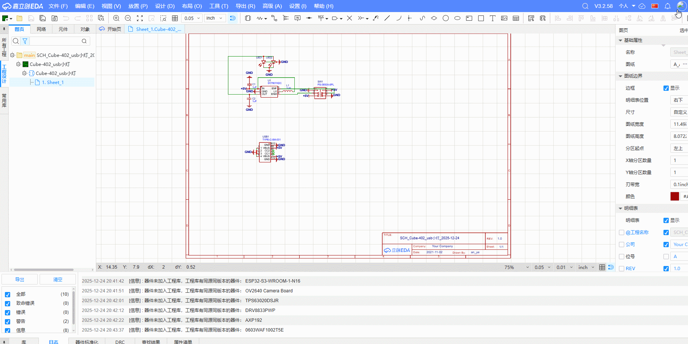
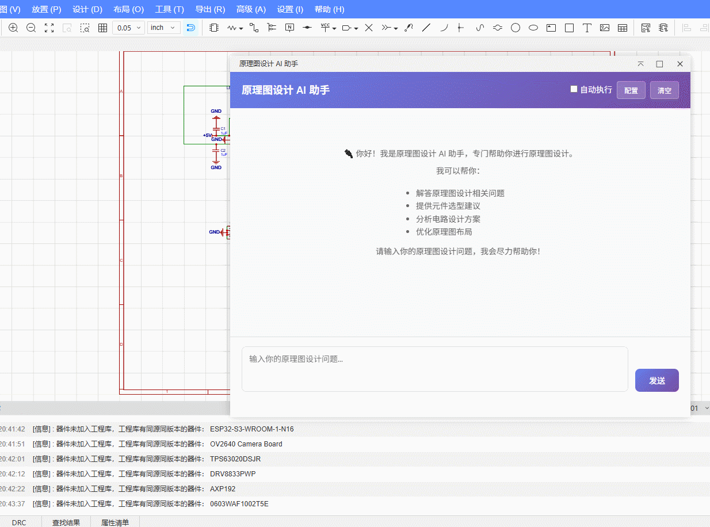
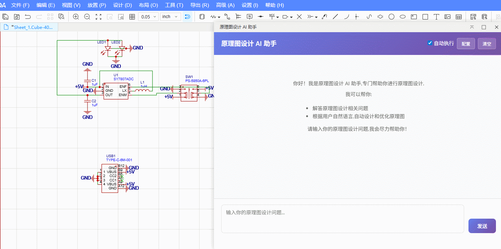
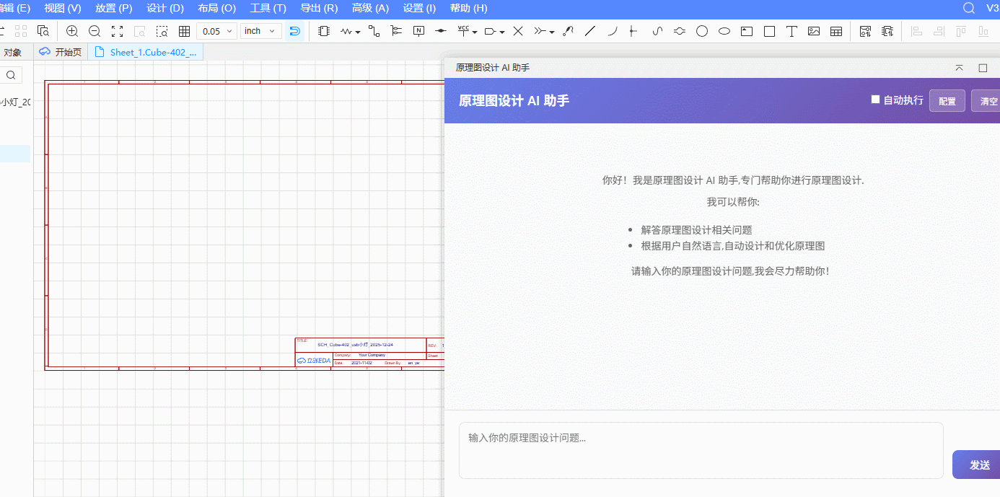

> 详细开发文档请访问：[https://prodocs.lceda.cn/cn/api/guide/](https://prodocs.lceda.cn/cn/api/guide/)

## 功能概述

pro-schematic-ai 是一款专为原理图设计人员开发的智能工具，具备以下核心功能：

1. **AI 对话**：支持自然语言问答与上下文管理，快速解答原理图设计相关问题
2. **工具调用**：AI 可以调用 EDA API 读取原理图信息，如查询选中元件、读取原理图结构等
3. **代码执行**：集成火山引擎 ARK API，为设计场景生成并执行代码，支持自动化操作
4. **安全确认**：代码执行前需用户确认，可开启自动执行开关实现自动执行

## 使用说明

### 1. 导入扩展

#### 扩展广场安装
1. 打开嘉立创EDA专业版
2. 高级 → 扩展管理器
3. 搜索 "AI 助手" 并安装

#### 本地导入安装
1. 下载构建产物（`./build/dist/` 下的扩展包）
2. 高级 → 扩展管理器 → 导入
3. 选择扩展包文件完成安装



### 2. 配置 API Key

1. 在扩展管理器中启用扩展，并确保已开启 **外部交互**
2. 打开 AI 助手对话界面（通过菜单 `AI 助手` → `原理图设计助手`）
3. 点击对话界面右上角的 **配置** 按钮
4. 在配置对话框中填写以下信息：
   - **API Key**：火山引擎 ARK API Key
   - **API Model**：API Model（使用私服时不需要填写）
   - **使用私服**：可选择使用私服模式，使用私服时只需填写 API Key

> 注意：
  需要配置自己的 AI KEY。ARK API 凭证获取方式：前往 [火山引擎官网](https://www.volcengine.com/) 注册并获取 API Key 和 Model 信息。
  或者点击配置对话框中的"私服登录"链接领取 token 后使用。



### 3. 使用入口

- Home / Sch / PCB 菜单：`AI 助手` → `原理图设计助手` 打开对话
- 关于：`AI 助手` → `About...`

## 功能介绍

### AI 对话

在输入框中输入原理图设计相关问题，AI 会根据问题给出专业回答。支持自然语言问答与上下文管理，能够理解设计意图并提供针对性建议。

AI 可以调用 EDA API 工具来读取原理图信息，例如：
- 查询选中元件的详细信息（参数、封装等）
- 读取原理图中的所有元件列表
- 获取元件的引脚信息
- 分析原理图结构和连接关系

### 元件信息查询

在原理图中选中元件后，在对话界面输入相关问题（如"查询这个元件的详细信息"），AI 会调用 EDA API 读取选中元件的信息并返回详细结果。



### 复合任务处理

AI 助手支持处理复杂的复合任务，可以一次性完成多个操作。例如：
- 查询多个元件信息并进行分析
- 批量读取原理图数据并进行处理
- 执行多个工具调用完成复杂的设计任务

通过自然语言描述任务需求，AI 会理解任务意图，自动调用多个 EDA API 工具，按步骤完成复合任务。



### 代码自动执行

AI 可以根据对话内容生成代码并执行，用于读取或修改原理图。代码执行机制：

- **确认执行**：默认情况下，AI 生成的代码会显示在对话界面，需要点击"确认执行"按钮才会执行
- **自动执行**：开启对话界面右上角的"自动执行"开关后，代码会在 2 秒后自动执行
- **安全机制**：写操作（修改原理图）默认需要确认，避免误修改设计文件

支持的操作包括：
- 批量修改元件参数
- 放置元件到原理图
- 创建导线连接
- 查询和分析原理图结构

## 兼容性

- 依赖嘉立创EDA专业版 `>= 2.3.0`（与 extension.json `engines.eda` 保持一致）

## 开发与构建

1. 克隆仓库

    ```shell
    git clone --depth=1 https://github.com/np1139059565/pro-schematic-ai.git
    ```

2. 安装依赖

    ```shell
    npm install
    ```

3. 编译扩展包

    ```shell
    npm run build
    ```

4. 在嘉立创EDA中导入 `./build/dist/` 的扩展包进行调试

## 更新日志

- 详见 `CHANGELOG.md`

## 反馈与支持

- Issues: https://github.com/np1139059565/pro-schematic-ai/issues
- 使用前请备份设计文件；建议先在测试工程验证

## 贡献指南

我们欢迎所有形式的贡献！无论是报告问题、提出功能建议，还是提交代码改进，都是对项目的宝贵支持。

### 如何参与贡献

1. **Fork 本仓库**：点击 GitHub 页面右上角的 Fork 按钮，将仓库复制到你的账户
2. **创建分支**：从 `main` 分支创建一个新的功能分支
   ```shell
   git checkout -b feature/your-feature-name
   ```
3. **进行开发**：在本地进行代码修改和测试
4. **提交更改**：提交你的更改并推送到你的 Fork
   ```shell
   git commit -m "feat: 添加新功能描述"
   git push origin feature/your-feature-name
   ```
5. **创建 Pull Request**：在 GitHub 上创建 Pull Request，详细描述你的更改内容

### 贡献类型

- 🐛 **Bug 修复**：修复代码中的错误
- ✨ **新功能**：添加新的功能特性
- 📝 **文档改进**：改进项目文档
- 🎨 **代码优化**：优化代码结构或性能
- 🔧 **工具改进**：改进开发工具或构建流程

### 代码规范

- 遵循项目现有的代码风格
- 确保代码通过 ESLint 和 Prettier 检查
- 添加必要的注释和文档
- 提交前运行 `npm run fix` 确保代码格式正确

### 问题反馈

如果发现 Bug 或有功能建议，请在 [Issues](https://github.com/np1139059565/pro-schematic-ai/issues) 页面提交。

感谢你的贡献！🎉

## 开源许可

本扩展包使用 [Apache License 2.0](https://choosealicense.com/licenses/apache-2.0/) 开源许可协议。
